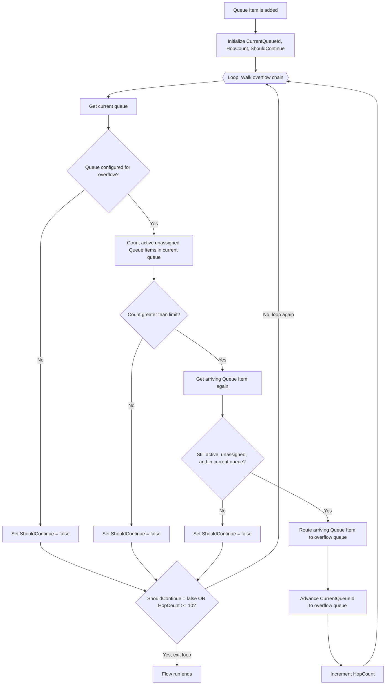

# Overflow Management Record Routing

> Proof-of-concept Power Platform solution for queue-length-based overflow of record work items in Dynamics 365 Customer Service Unified Routing.

## Overview

The **Overflow** solution uses Power Automate and a dedicated model-driven app to let administrators configure overflow rules for record-based queues. A rule defines:

- The source, or origin, queue.
- Whether custom overflow is enabled.
- The maximum number of active, unpicked work items allowed in the source queue.
- The target queue that receives the next work item when the limit is exceeded.

For example, if Queue A has a work item limit of 10, the first 10 active unpicked work items remain in Queue A. When item 11 is added, the flow moves that newly arrived item to the configured overflow queue.

Overflow rules can be chained: Queue A can overflow to Queue B, and Queue B can independently overflow to Queue C, each with its own work item limit. The flow walks this chain automatically within a single run, so an item that arrives when both Queue A and Queue B are already full lands directly in Queue C. See [Cascading overflow through multiple queues](#cascading-overflow-through-multiple-queues) for how this works and how it was verified.

This solution was created to explore a gap in the standard Unified Routing overflow experience: the native **Work item limit exceeds** condition is not available for record-based queues.

## Version history

| Version | Change |
| --- | --- |
| `1.1.0.0` | Added cascading overflow: the flow now walks an entire overflow chain (Queue A → Queue B → Queue C → ...) in a single run instead of stopping after one hop. See [Cascading overflow through multiple queues](#cascading-overflow-through-multiple-queues). |
| `1.0.0.1` | Added a Filter rows expression to the trigger, restricting flow runs to Case, Email, and Task Queue Items, and added a Queue-type guard so only Entity/Record queues are evaluated. |
| `1.0.0.0` | Initial release: single-hop overflow based on active, unpicked work item count. |

## Download

Download the latest unmanaged solution package: **[Overflow.zip](Overflow.zip)** (version `1.1.0.0`).

## Solution contents

The solution includes:

| Component | Purpose |
| --- | --- |
| **Overflow Management** model-driven app | Dedicated administration experience. |
| **Overflow Management** generative page | Visual three-pane interface for finding queues, reviewing rules, and editing configuration. |
| **Record Queue - Work Item Limit Overflow** cloud flow | Monitors new Queue Items and performs overflow routing. |
| **Overflow - Microsoft Dataverse** connection reference | Portable Dataverse connection used by the cloud flow. |
| Queue table extension | Adds three custom overflow fields and a self-referencing queue relationship. |
| **All queues - Overflow management** view | Shows all queues and their overflow configuration. |
| **Queues with overflow rules** view | Shows queues with complete or partial custom overflow configuration. |
| **Overflow Queue Configuration** form | Focused native model-driven form for editing an overflow rule. |


## Administration experiences

### Generative page

The generative page provides a visual administration experience with three sections:

1. **Queues** - Search, filter by queue type, sort A-Z or Z-A, and select an active queue.
2. **Overflow rules** - Review every configured source-to-target route and see its status, limit, and Queue Item count.
3. **Rule editor** - Enable or disable overflow, edit the work item limit, select the overflow queue, and save the changes.

Queue types and rule states use Fluent semantic colors. The selected queue is shaded and marked with a colored accent edge.


### Native Queue views and form

The same configuration can be maintained through standard model-driven app views and forms. This is useful when an organization prefers the conventional Dynamics 365 experience or wants to add the artifacts to an existing app.

The included views show:

- Origin queue name.
- Queue type.
- Queue Items.
- Custom overflow enabled.
- Work item limit.
- Overflow queue.
- Queue status.

#### Queues with overflow rules

This view includes queues where at least one custom overflow setting is populated. Partial configurations are intentionally included so administrators can identify and correct them.


#### All queues

This view exposes the overflow columns across all Queue records.


#### Overflow Queue Configuration form

The focused Queue form contains:

- **Origin queue** - The standard Queue name field, relabeled for this experience.
- **Overflow enabled**.
- **Work item limit**.
- **Overflow queue**.

The origin queue is not a separate custom lookup. It is the Queue record currently open in the form.

> The generative page performs additional validation, including preventing self-routing and requiring a valid limit and destination before a rule can be enabled. The native form relies on administrator discipline unless additional business rules are added.

## Queue fields

The solution extends the standard Queue table with only these custom components:

| Display name | Logical name | Type | Purpose |
| --- | --- | --- | --- |
| Custom overflow enabled | `dny_overflowenabled` | Yes/No | Controls whether the flow evaluates the queue for overflow. |
| Work item limit | `dny_workitemlimit` | Whole number, 1-100000 | Maximum number of active unpicked work items retained in the source queue. |
| Overflow queue | `dny_overflowqueueid` | Lookup to Queue | Target queue for an over-limit arriving work item. |
| Queue overflow relationship | `dny_queue_overflowqueue` | Queue-to-Queue relationship | Supports the self-referencing lookup. |

The Queue table is included as a segmented system table. Existing standard Queue fields are dependencies, not customizations introduced by this solution.

## What counts as an unpicked work item?

The flow counts Queue Item records that meet all three conditions:

1. The Queue Item belongs to the source queue.
2. The Queue Item is active: `statecode = 0`.
3. **Worked By** is empty: `workerid is null`.

This is the count used for the overflow decision.

The **Queue items** value shown in the page and native views comes from the standard Queue `NumberOfItems` field. Microsoft defines it as the number of Queue Items associated with the queue. It is useful operational context, but it is not guaranteed to equal the flow's stricter active-and-unpicked count.

## Cloud flow architecture

Version `1.1.0.0` introduces **cascading overflow**: a single flow run now walks the entire overflow chain (Queue A → Queue B → Queue C → ...) instead of stopping after one hop. See [Cascading overflow through multiple queues](#cascading-overflow-through-multiple-queues) below for why this was needed and how it was verified.



## Every flow node explained

### 1. When a queue item is added

**Type:** Dataverse trigger - When a row is added, modified, or deleted.

The trigger listens for the **Added** event on the Queue Item table at organization scope. Its **Filter rows** setting allows only Case, Email, and Task Queue Items to start a flow run:

```text
objecttypecode eq 112 or objecttypecode eq 4202 or objecttypecode eq 4212
```

| Work item type | Object type code |
| --- | ---: |
| Case | `112` |
| Email | `4202` |
| Task | `4212` |

Dataverse evaluates this OData expression before creating a flow run. Other Queue Item types therefore do not consume a run. This was verified with live Queue Items: Case, Email, and Task each started a run, while a Phone Call (`4210`) did not.

The filter identifies the underlying work item type, not the destination queue type. Each queue in the chain is checked separately by the loop below.

The trigger is intentionally reusable. There is one flow for the environment, not one flow per queue.

Trigger concurrency is set to **1**. Runs are processed serially so simultaneous arrivals do not all evaluate the same stale queue count in parallel.

Critically, the trigger only fires on **Added** (Create), not on Update. The `RouteTo` action used later in the flow updates the Queue Item's `queueid` in place — it does not delete and recreate the record. This means a route never re-fires the trigger on its own; cascading through multiple queues has to happen inside a single flow run, which is exactly what the loop below does.

### 2. Initialize loop variables

**Type:** Three `Initialize variable` actions, run once before the loop.

| Variable | Type | Initial value | Purpose |
| --- | --- | --- | --- |
| `CurrentQueueId` | String | The triggering Queue Item's `_queueid_value` | Tracks which queue is being evaluated on the current hop. Updated after each successful route. |
| `HopCount` | Integer | `0` | Counts how many times the item has been routed in this run. |
| `ShouldContinue` | Boolean | `true` | Controls whether the loop keeps evaluating another hop. |

### 3. Walk overflow chain (Do Until loop)

**Type:** `Until` loop.

The loop repeats the nodes below until either exit condition is true:

```text
ShouldContinue = false
  OR
HopCount >= 10
```

`ShouldContinue = false` is the normal exit: the current queue isn't over its limit, isn't configured for overflow, or the item is no longer eligible to move. The `HopCount >= 10` cap is a safety ceiling against a misconfigured circular chain (for example Queue A overflowing to Queue B, which overflows back to Queue A) — it stops the loop after 10 hops rather than looping indefinitely. The loop also has its own built-in `PT10M` (10 minute) timeout as a second safety net.

Each iteration of the loop performs the same sequence of checks as before, but evaluated against `CurrentQueueId` — which starts as the original source queue and advances one hop at a time:

#### 3a. Get current queue

**Type:** Dataverse - Get a row by ID.

Retrieves the queue identified by `CurrentQueueId` and reads:

- Queue name.
- Queue type.
- Custom overflow enabled.
- Work item limit.
- Overflow queue.

#### 3b. Queue supports overflow

**Type:** Condition.

All four checks must be true:

1. `msdyn_queuetype` is `192350001`, which is an Entity/Record queue.
2. `dny_overflowenabled` is true.
3. `dny_workitemlimit` is not null.
4. `dny_overflowqueueid` is not null.

**If No:** `ShouldContinue` is set to `false` and the loop exits — this queue is the end of the chain (or was never enabled for overflow).

**If Yes:** The flow continues to count active unpicked items in this queue.

#### 3c. Count active unassigned items

**Type:** Dataverse - List rows with an aggregate FetchXML query.

The FetchXML query counts Queue Items where:

```text
queueid = CurrentQueueId
statecode = Active
workerid = null
```

The result is returned as `item_count`. This node counts unpicked work rather than all records associated with the queue.

#### 3d. Limit is exceeded

**Type:** Condition.

The condition compares:

```text
item_count > configured work item limit
```

The comparison uses **greater than**, not greater than or equal to. For a limit of 10, counts 1 through 10 remain in the queue; count 11 enters the Yes branch.

**If No:** `ShouldContinue` is set to `false` and the loop exits — this queue has capacity, so the item stays here.

**If Yes:** The flow rereads the specific arriving Queue Item before moving it.

#### 3e. Get arriving queue item

**Type:** Dataverse - Get a row by ID.

Power Automate runs asynchronously, and this action also runs again on every subsequent hop. Between the initial trigger (or the previous hop's route) and this decision, Unified Routing or an agent might have assigned, closed, or otherwise moved the item.

This node retrieves the arriving Queue Item again and reads:

- Current Queue.
- Current Worked By value.
- Current state.

This is a safety check against routing stale data, re-verified on every hop.

#### 3f. Item is still eligible

**Type:** Condition.

All three checks must still be true:

1. The Queue Item is active.
2. Worked By is empty.
3. The Queue Item is still in `CurrentQueueId` (the queue this hop is evaluating).

**If No:** `ShouldContinue` is set to `false` and the loop exits. The flow does not take work away from a representative or move an item that another process already handled.

**If Yes:** The flow routes the item to the configured overflow queue.

#### 3g. Route to overflow queue, advance, and increment hop count

**Type:** Dataverse - Perform an unbound action using `RouteTo`, followed by two `Set variable` actions.

- **Route to overflow queue** receives the configured overflow queue as the target and the Queue Item as the item to route. This changes the Queue Item's `queueid` in place (same `queueitemid`, new queue) and allows Unified Routing to process it from the destination queue.
- **Advance CurrentQueueId** sets the loop's tracking variable to the queue that was just routed to, so the next iteration evaluates *that* queue's limit.
- **Increment HopCount** adds 1 to the hop counter.

The loop then re-evaluates from step 3a against the new `CurrentQueueId`. If that queue is also over its limit, the item is routed again in the same run; if not, `ShouldContinue` becomes `false` and the run ends with the item in its final queue.

Only the single arriving over-limit item is ever moved on each hop. Existing backlog already waiting in any queue along the chain is not redistributed.


## Cascading overflow through multiple queues

The flow supports **hierarchical overflow chains**: Queue A can overflow to Queue B, and Queue B can independently overflow to Queue C, each with its own work item limit. This was not true in version `1.0.x` — the flow only ever performed one hop per trigger, because `RouteTo` updates the existing Queue Item rather than creating a new one, and the trigger only fires on Create.

Version `1.1.0.0` fixes this by looping through the chain inside a single flow run (see [section 3 above](#3-walk-overflow-chain-do-until-loop)). This was verified live with a three-queue chain (Queue A → Queue B → Queue C), each with a work item limit of 1 and a filler item already occupying Queue A and Queue B:

| Scenario | Expected result | Result |
| --- | --- | --- |
| New Case added to Queue A (already at its limit) | Item cascades through Queue B (also at its limit) and lands in Queue C | Passed — confirmed via the Queue Item's final `_queueid_value` |
| Filler item in Queue A | Stays in Queue A, untouched by the cascading item passing through | Passed |
| Filler item in Queue B | Stays in Queue B, untouched by the cascading item passing through | Passed |
| Boundary re-check: single item in an otherwise-empty queue at its limit | Item remains in that queue (count equals, not exceeds, the limit) | Passed |

The filler items staying in place proves each hop's limit is evaluated independently — the loop doesn't just skip through every queue in the chain, it only advances past queues that are genuinely over their configured limit.

A hop cap of 10 prevents an accidental circular configuration (Queue A → Queue B → Queue A) from looping indefinitely; the loop also times out after 10 minutes as a second safety net. Neither limit is expected to be reached in a normal, non-circular hierarchy.

## Why the flow contains several conditions

The flow could be shorter, but the additional conditions protect active work:

- The overflow-configuration condition avoids processing queues without a complete rule, and marks the natural end of the chain.
- The count condition implements the actual overflow threshold at each hop.
- The eligibility condition prevents an asynchronous race from moving an item after it has been assigned, closed, or moved elsewhere — re-checked on every hop, not just the first.

These are safety checks rather than duplicate business logic.

## Installation

### Prerequisites

The target environment should have:

- Microsoft Dataverse.
- Dynamics 365 Customer Service or Dynamics 365 Contact Center components that provide Unified Routing and advanced record queues.
- Appropriate Power Apps and Power Automate licensing.
- An administrator who can import solutions, create or select a Dataverse connection, assign app access, and enable cloud flows.

Licensing and entitlements must be confirmed for each tenant.

### Interactive import

1. Import `Overflow.zip` into the target environment.
2. When prompted, map `dny_OverflowDataverse` to an existing Dataverse connection or create a new connection.
3. Complete the solution import.
4. Open the cloud flow **Record Queue - Work Item Limit Overflow** and confirm that its connection reference is valid.
5. Enable the cloud flow if it imported in an Off state.
6. Assign the required security roles and app access to administrators who will use **Overflow Management**.
7. Validate the behavior in a non-production environment before wider use.

The connection belongs to the target tenant. The source tenant's connection and credentials are not transported in the solution.

### Automated import

For automated deployment, create a deployment settings file with this connection-reference mapping:

```json
{
  "ConnectionReferences": [
    {
      "LogicalName": "dny_OverflowDataverse",
      "ConnectionId": "",
      "ConnectorId": "/providers/Microsoft.PowerApps/apis/shared_commondataserviceforapps"
    }
  ]
}
```

Populate `ConnectionId` with the target environment's Dataverse connection ID and use the settings file with the supported Power Platform solution import process.

## Required permissions

The account behind `dny_OverflowDataverse` must be able to:

- Read Queue records.
- Read Queue Item records.
- Execute the Queue Item `RouteTo` action.
- Register and run the Dataverse trigger.

Administrators using the UI need read access to Queue records and write access to the three custom overflow fields.

Use a governed service account or application identity where appropriate for the organization's operating model. Avoid tying production automation to a temporary personal account.

## Configuring a rule

### Through the generative page

1. Open **Overflow Management**.
2. Filter to **Record** queues if needed.
3. Select the origin queue.
4. Set **Status** to Enabled.
5. Enter a positive whole-number work item limit.
6. Select another compatible record queue as the overflow destination.
7. Select **Save**.

### Through the native form

1. Open **Queue views and forms**.
2. Select **All queues - Overflow management** or **Queues with overflow rules**.
3. Open the origin queue.
4. Use the **Overflow Queue Configuration** form.
5. Set Overflow enabled, Work item limit, and Overflow queue.
6. Save the Queue record.

This proof of concept is intended for record-based queues. Configure both the origin and destination as compatible record queues.

## Reusing the experiences in another model-driven app

The administration artifacts can be added to another model-driven app:

- Add the existing **Overflow Management** generative page to the app sitemap.
- Add the standard Queue table as a segmented component.
- Select the two included Queue views.
- Select the **Overflow Queue Configuration** form.

The cloud flow remains environment-wide. Do not create another copy of the flow for each app or queue.

## Validation performed

The cloud flow was tested in an isolated non-production scenario:

| Scenario | Expected result | Result |
| --- | --- | --- |
| Rule disabled | Item remains in Queue A | Passed |
| Count exactly equals limit | Item remains in Queue A | Passed |
| Count exceeds limit | Newly arriving item moves to Queue B | Passed |
| Over-limit action trace | Count, reread, eligibility check, and `RouteTo` all succeed | Passed |
| Case, Email, and Task trigger filter | Each allowed type starts a run | Passed |
| Phone Call trigger filter | Excluded type does not start a run | Passed |
| Cascading overflow (Queue A → B → C, all at their limit) | Item lands in Queue C within a single flow run | Passed |
| Cascading overflow — intermediate queue fillers | Filler items in Queue A and Queue B stay in place, untouched | Passed |
| Cascading overflow — boundary re-check | A single item in an otherwise-empty limited queue still remains there | Passed |

Temporary test queues, tasks, and Queue Items were removed after testing.

## Customization

The solution is intentionally distributed as **unmanaged** so customers can inspect and adapt it.

Possible customizations include:

- Changing the page layout, colors, filters, or labels.
- Adding business rules to the native Queue form.
- Restricting selectable queues to specific queue types.
- Adding configuration validation.
- Adding monitoring, logging, alerts, or an overflow audit table.
- Changing the Queue Item types allowed by the trigger's **Filter rows** expression.
- Changing the concurrency and throughput design after load testing.
- Adjusting the hop cap (currently 10) or adding explicit circular-chain detection.
- Implementing a synchronous plug-in if an asynchronous delay is unacceptable.

### Generative page files

The UX Agent Project contains several expected files:

| File | Purpose |
| --- | --- |
| `page.tsx` | Editable React and TypeScript source for the generative page. |
| `page.compiled` | Compiled JavaScript executed by the page host. |
| `config.json` | Page configuration, including the Queue data source and generation model. |
| `firstPrompt.json` | Generation provenance containing the original page request and agent summary. |

`config.json` and `firstPrompt.json` are supporting generative-page artifacts. They are not additional flows and do not independently execute business logic.

### Cloud flow file

The exported cloud flow is stored under the solution's `Workflows` folder as:

```text
RecordQueue-WorkItemLimitOverflow-<workflow-id>.json
```

That JSON file contains the trigger, conditions, FetchXML aggregate query, safety checks, and `RouteTo` action described above.

## Limitations and production considerations

- This is an asynchronous cloud-flow design. Overflow normally occurs shortly after item creation, not within the original routing transaction.
- Trigger concurrency is set to one for predictable counting. High-volume environments must load-test throughput and backlog behavior.
- The flow checks a point-in-time Dataverse count at each hop.
- Only the new over-limit arrival is moved; existing backlog at any queue in the chain is not rebalanced.
- The target queue's own backlog is evaluated on the next loop iteration, but only for the single item currently being routed — not proactively for other items already waiting there.
- Cascading is capped at 10 hops per flow run, with a 10-minute loop timeout as a second safety net. This guards against a misconfigured circular chain (Queue A → Queue B → Queue A) but is not expected to be reached in a normal hierarchy.
- The generative page validates self-routing and required values. The native form does not add equivalent business rules by default. Neither surface currently validates that a chain of overflow queues does not form a cycle.
- The trigger starts runs only for Case (`112`), Email (`4202`), and Task (`4212`) Queue Items. Extend the **Filter rows** expression if other record types must participate.
- The source queue must be an Entity/Record queue and have a complete enabled overflow configuration; otherwise the run exits without routing.
- The visible standard **Queue items** count is not the same as the active-unpicked count used by the flow.
- Solution dependencies and behavior can vary with installed Dynamics 365 Customer Service and Unified Routing versions.
- Security, data loss prevention, auditing, monitoring, licensing, support, and application lifecycle management must be reviewed by the deploying organization.

## Disclaimer

**This solution is an independent proof of concept, not an official or supported Microsoft product. It is provided as-is, without warranties or guarantees of any kind. Neither Daniel Aghajani nor Microsoft accepts responsibility or liability for its use, operation, modification, deployment, or any resulting impact.**

Customers are encouraged to use this solution as inspiration for their own production architecture. Before production deployment, customers should perform their own technical design review, security and compliance review, licensing validation, performance and concurrency testing, failure-mode analysis, monitoring design, user acceptance testing, and operational readiness assessment.

## Repository artifacts

```text
README.md
Overflow.zip
docs/
  images/
```

- `Overflow.zip` is the latest unmanaged solution export.
- `docs/images/` contains sanitized screenshots used by this README.
