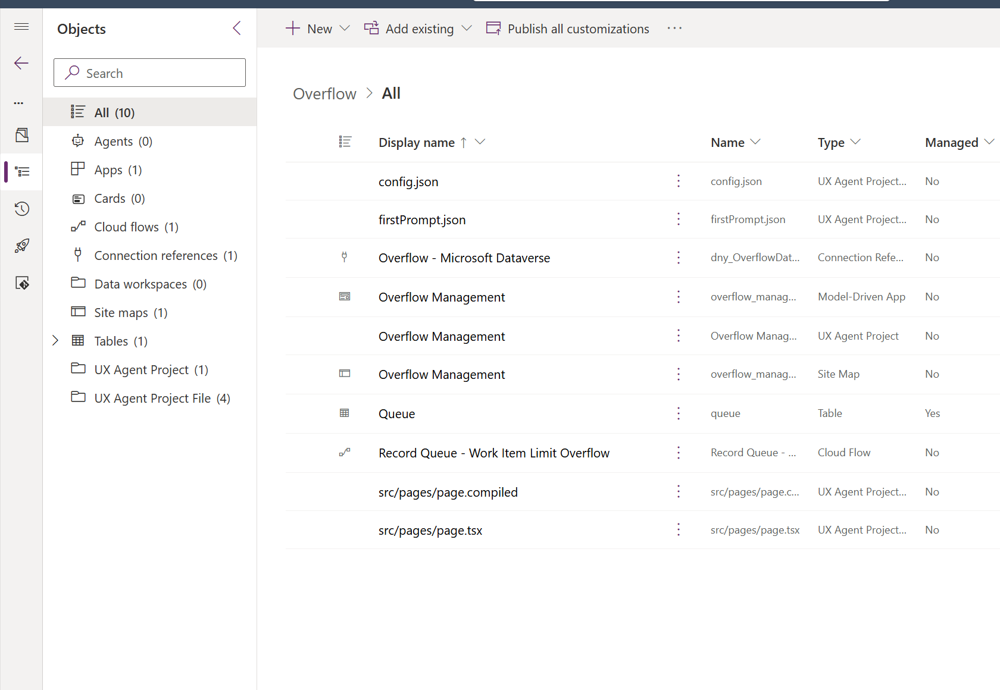
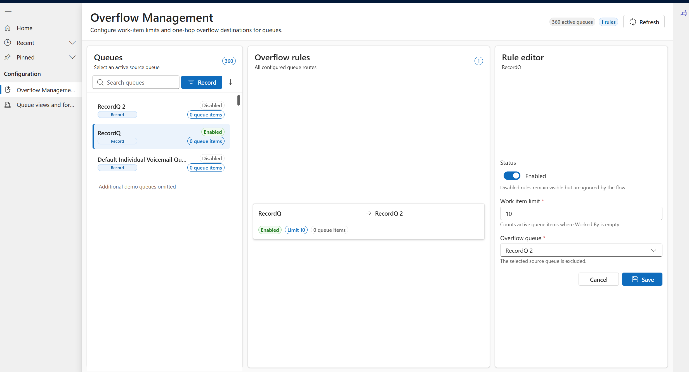
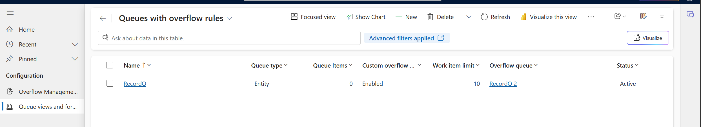
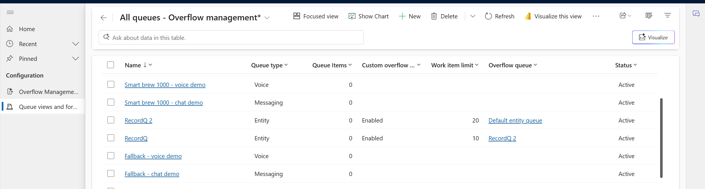
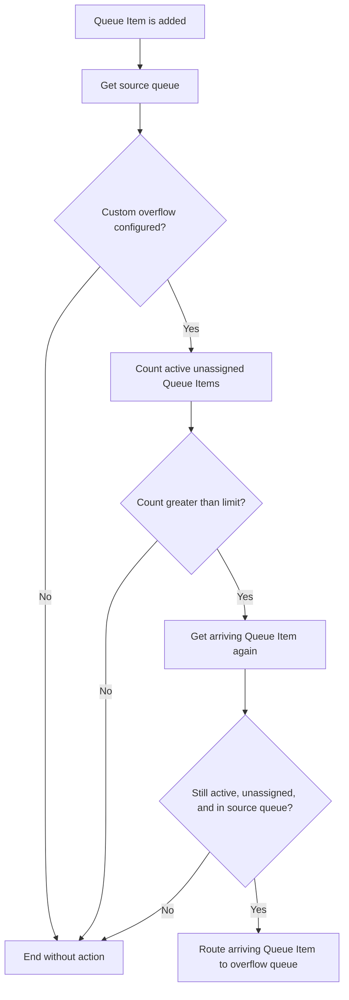
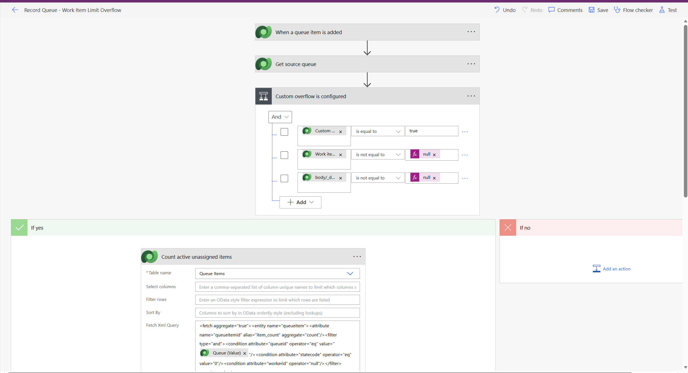

# Overflow Management Record Routing

> Proof-of-concept Power Platform solution for queue-length-based overflow of record work items in Dynamics 365 Customer Service Unified Routing.

## Overview

The **Overflow** solution uses Power Automate and a dedicated model-driven app to let administrators configure overflow rules for record-based queues. A rule defines:

- The source, or origin, queue.
- Whether custom overflow is enabled.
- The maximum number of active, unpicked work items allowed in the source queue.
- The target queue that receives the next work item when the limit is exceeded.

For example, if Queue A has a work item limit of 10, the first 10 active unpicked work items remain in Queue A. When item 11 is added, the flow moves that newly arrived item to the configured overflow queue.

This solution was created to explore a gap in the standard Unified Routing overflow experience: the native **Work item limit exceeds** condition is not available for record-based queues.

## Download

Download the latest unmanaged solution package: **[Overflow.zip](Overflow.zip)** (version `1.0.0.1`).

## Solution contents

The solution includes:

| Component | Purpose |
| --- | --- |
| **Overflow Management** model-driven app | Dedicated administration experience. |
| **Overflow Management** generative page | Visual three-pane interface for finding queues, reviewing rules, and editing configuration. |
| **Record Queue - Work Item Limit Overflow** cloud flow | Monitors new Queue Items and performs overflow routing. |
| **Overflow - Microsoft Dataverse** connection reference | Portable Dataverse connection used by the cloud flow. |
| Queue table extension | Adds three custom overflow fields and a self-referencing queue relationship. |
| **All queues - Overflow management** view | Shows all queues and their overflow configuration. |
| **Queues with overflow rules** view | Shows queues with complete or partial custom overflow configuration. |
| **Overflow Queue Configuration** form | Focused native model-driven form for editing an overflow rule. |



## Administration experiences

### Generative page

The generative page provides a visual administration experience with three sections:

1. **Queues** - Search, filter by queue type, sort A-Z or Z-A, and select an active queue.
2. **Overflow rules** - Review every configured source-to-target route and see its status, limit, and Queue Item count.
3. **Rule editor** - Enable or disable overflow, edit the work item limit, select the overflow queue, and save the changes.

Queue types and rule states use Fluent semantic colors. The selected queue is shaded and marked with a colored accent edge.



### Native Queue views and form

The same configuration can be maintained through standard model-driven app views and forms. This is useful when an organization prefers the conventional Dynamics 365 experience or wants to add the artifacts to an existing app.

The included views show:

- Origin queue name.
- Queue type.
- Queue Items.
- Custom overflow enabled.
- Work item limit.
- Overflow queue.
- Queue status.

#### Queues with overflow rules

This view includes queues where at least one custom overflow setting is populated. Partial configurations are intentionally included so administrators can identify and correct them.



#### All queues

This view exposes the overflow columns across all Queue records.



#### Overflow Queue Configuration form

The focused Queue form contains:

- **Origin queue** - The standard Queue name field, relabeled for this experience.
- **Overflow enabled**.
- **Work item limit**.
- **Overflow queue**.

The origin queue is not a separate custom lookup. It is the Queue record currently open in the form.

> The generative page performs additional validation, including preventing self-routing and requiring a valid limit and destination before a rule can be enabled. The native form relies on administrator discipline unless additional business rules are added.

## Queue fields

The solution extends the standard Queue table with only these custom components:

| Display name | Logical name | Type | Purpose |
| --- | --- | --- | --- |
| Custom overflow enabled | `dny_overflowenabled` | Yes/No | Controls whether the flow evaluates the queue for overflow. |
| Work item limit | `dny_workitemlimit` | Whole number, 1-100000 | Maximum number of active unpicked work items retained in the source queue. |
| Overflow queue | `dny_overflowqueueid` | Lookup to Queue | Target queue for an over-limit arriving work item. |
| Queue overflow relationship | `dny_queue_overflowqueue` | Queue-to-Queue relationship | Supports the self-referencing lookup. |

The Queue table is included as a segmented system table. Existing standard Queue fields are dependencies, not customizations introduced by this solution.

## What counts as an unpicked work item?

The flow counts Queue Item records that meet all three conditions:

1. The Queue Item belongs to the source queue.
2. The Queue Item is active: `statecode = 0`.
3. **Worked By** is empty: `workerid is null`.

This is the count used for the overflow decision.

The **Queue items** value shown in the page and native views comes from the standard Queue `NumberOfItems` field. Microsoft defines it as the number of Queue Items associated with the queue. It is useful operational context, but it is not guaranteed to equal the flow's stricter active-and-unpicked count.

## Cloud flow architecture



## Every flow node explained

### 1. When a queue item is added

**Type:** Dataverse trigger - When a row is added, modified, or deleted.

The trigger listens for the **Added** event on the Queue Item table at organization scope. Its **Filter rows** setting allows only Case, Email, and Task Queue Items to start a flow run:

```text
objecttypecode eq 112 or objecttypecode eq 4202 or objecttypecode eq 4212
```

| Work item type | Object type code |
| --- | ---: |
| Case | `112` |
| Email | `4202` |
| Task | `4212` |

Dataverse evaluates this OData expression before creating a flow run. Other Queue Item types therefore do not consume a run. This was verified with live Queue Items: Case, Email, and Task each started a run, while a Phone Call (`4210`) did not.

The filter identifies the underlying work item type, not the destination queue type. The source Queue is retrieved in the next node so the flow can separately verify that it is an Entity/Record queue.

The trigger is intentionally reusable. There is one flow for the environment, not one flow per queue. Queues without enabled custom overflow configuration exit at the first condition.

Trigger concurrency is set to **1**. Runs are processed serially so simultaneous arrivals do not all evaluate the same stale queue count in parallel.

### 2. Get source queue

**Type:** Dataverse - Get a row by ID.

The Queue Item trigger provides the ID of the queue that received the work item. This node retrieves that Queue record and reads:

- Queue name.
- Queue type.
- Custom overflow enabled.
- Work item limit.
- Overflow queue.

No unrelated Queue fields are required for the overflow decision.

### 3. Custom overflow is configured

**Type:** Condition.

All four checks must be true:

1. `msdyn_queuetype` is `192350001`, which is an Entity/Record queue.
2. `dny_overflowenabled` is true.
3. `dny_workitemlimit` is not null.
4. `dny_overflowqueueid` is not null.

**If No:** The run ends without counting items or changing the Queue Item.

**If Yes:** The flow continues to count active unpicked items.

This guard avoids unnecessary Dataverse aggregate queries for queues that do not use the custom feature. It also prevents a partial configuration from attempting a route.

### 4. Count active unassigned items

**Type:** Dataverse - List rows with an aggregate FetchXML query.

The FetchXML query counts Queue Items where:

```text
queueid = source queue
statecode = Active
workerid = null
```

The result is returned as `item_count`.

This node counts unpicked work rather than all records associated with the queue.

### 5. Limit is exceeded

**Type:** Condition.

The condition compares:

```text
item_count > configured work item limit
```

The comparison uses **greater than**, not greater than or equal to.

For a limit of 10:

- Counts 1 through 10 remain in the source queue.
- Count 11 enters the Yes branch.

**If No:** The run ends and the arriving Queue Item remains in the source queue.

**If Yes:** The flow rereads the specific arriving Queue Item before moving it.

### 6. Get arriving queue item

**Type:** Dataverse - Get a row by ID.

Power Automate runs asynchronously. Between the initial trigger and the overflow decision, Unified Routing might assign or move the work item.

This node retrieves the arriving Queue Item again and reads:

- Current Queue.
- Current Worked By value.
- Current state.

This is a safety check against routing stale data.

### 7. Item is still eligible

**Type:** Condition.

All three checks must still be true:

1. The Queue Item is active.
2. Worked By is empty.
3. The Queue Item is still in the original source queue.

**If No:** The flow stops. It does not take work away from a representative or move an item that another process already handled.

**If Yes:** The flow routes the item to the configured overflow queue.

### 8. Route to overflow queue

**Type:** Dataverse - Perform an unbound action using `RouteTo`.

The action receives:

- The configured overflow Queue as the target.
- The newly arrived Queue Item as the item to route.

The supported Dataverse `RouteTo` action changes the Queue Item's queue and allows Unified Routing to process it from the destination queue.

Only the arriving over-limit item is moved. Existing work already waiting in the source queue is not redistributed.



## Why the flow contains several conditions

The flow could be shorter, but the additional conditions protect active work:

- The first condition avoids processing queues without a complete rule.
- The count condition implements the actual overflow threshold.
- The final condition prevents an asynchronous race from moving an item after it has been assigned, closed, or moved elsewhere.

These are safety checks rather than duplicate business logic.

## Installation

### Prerequisites

The target environment should have:

- Microsoft Dataverse.
- Dynamics 365 Customer Service or Dynamics 365 Contact Center components that provide Unified Routing and advanced record queues.
- Appropriate Power Apps and Power Automate licensing.
- An administrator who can import solutions, create or select a Dataverse connection, assign app access, and enable cloud flows.

Licensing and entitlements must be confirmed for each tenant.

### Interactive import

1. Import `Overflow.zip` into the target environment.
2. When prompted, map `dny_OverflowDataverse` to an existing Dataverse connection or create a new connection.
3. Complete the solution import.
4. Open the cloud flow **Record Queue - Work Item Limit Overflow** and confirm that its connection reference is valid.
5. Enable the cloud flow if it imported in an Off state.
6. Assign the required security roles and app access to administrators who will use **Overflow Management**.
7. Validate the behavior in a non-production environment before wider use.

The connection belongs to the target tenant. The source tenant's connection and credentials are not transported in the solution.

### Automated import

For automated deployment, create a deployment settings file with this connection-reference mapping:

```json
{
  "ConnectionReferences": [
    {
      "LogicalName": "dny_OverflowDataverse",
      "ConnectionId": "",
      "ConnectorId": "/providers/Microsoft.PowerApps/apis/shared_commondataserviceforapps"
    }
  ]
}
```

Populate `ConnectionId` with the target environment's Dataverse connection ID and use the settings file with the supported Power Platform solution import process.

## Required permissions

The account behind `dny_OverflowDataverse` must be able to:

- Read Queue records.
- Read Queue Item records.
- Execute the Queue Item `RouteTo` action.
- Register and run the Dataverse trigger.

Administrators using the UI need read access to Queue records and write access to the three custom overflow fields.

Use a governed service account or application identity where appropriate for the organization's operating model. Avoid tying production automation to a temporary personal account.

## Configuring a rule

### Through the generative page

1. Open **Overflow Management**.
2. Filter to **Record** queues if needed.
3. Select the origin queue.
4. Set **Status** to Enabled.
5. Enter a positive whole-number work item limit.
6. Select another compatible record queue as the overflow destination.
7. Select **Save**.

### Through the native form

1. Open **Queue views and forms**.
2. Select **All queues - Overflow management** or **Queues with overflow rules**.
3. Open the origin queue.
4. Use the **Overflow Queue Configuration** form.
5. Set Overflow enabled, Work item limit, and Overflow queue.
6. Save the Queue record.

This proof of concept is intended for record-based queues. Configure both the origin and destination as compatible record queues.

## Reusing the experiences in another model-driven app

The administration artifacts can be added to another model-driven app:

- Add the existing **Overflow Management** generative page to the app sitemap.
- Add the standard Queue table as a segmented component.
- Select the two included Queue views.
- Select the **Overflow Queue Configuration** form.

The cloud flow remains environment-wide. Do not create another copy of the flow for each app or queue.

## Validation performed

The cloud flow was tested in an isolated non-production scenario:

| Scenario | Expected result | Result |
| --- | --- | --- |
| Rule disabled | Item remains in Queue A | Passed |
| Count exactly equals limit | Item remains in Queue A | Passed |
| Count exceeds limit | Newly arriving item moves to Queue B | Passed |
| Over-limit action trace | Count, reread, eligibility check, and `RouteTo` all succeed | Passed |
| Case, Email, and Task trigger filter | Each allowed type starts a run | Passed |
| Phone Call trigger filter | Excluded type does not start a run | Passed |

Temporary test queues, tasks, and Queue Items were removed after testing.

## Customization

The solution is intentionally distributed as **unmanaged** so customers can inspect and adapt it.

Possible customizations include:

- Changing the page layout, colors, filters, or labels.
- Adding business rules to the native Queue form.
- Restricting selectable queues to specific queue types.
- Adding configuration validation.
- Adding monitoring, logging, alerts, or an overflow audit table.
- Changing the Queue Item types allowed by the trigger's **Filter rows** expression.
- Changing the concurrency and throughput design after load testing.
- Adding multiple fallback strategies or controlled cascading.
- Implementing a synchronous plug-in if an asynchronous delay is unacceptable.

### Generative page files

The UX Agent Project contains several expected files:

| File | Purpose |
| --- | --- |
| `page.tsx` | Editable React and TypeScript source for the generative page. |
| `page.compiled` | Compiled JavaScript executed by the page host. |
| `config.json` | Page configuration, including the Queue data source and generation model. |
| `firstPrompt.json` | Generation provenance containing the original page request and agent summary. |

`config.json` and `firstPrompt.json` are supporting generative-page artifacts. They are not additional flows and do not independently execute business logic.

### Cloud flow file

The exported cloud flow is stored under the solution's `Workflows` folder as:

```text
RecordQueue-WorkItemLimitOverflow-<workflow-id>.json
```

That JSON file contains the trigger, conditions, FetchXML aggregate query, safety checks, and `RouteTo` action described above.

## Limitations and production considerations

- This is an asynchronous cloud-flow design. Overflow normally occurs shortly after item creation, not within the original routing transaction.
- Trigger concurrency is set to one for predictable counting. High-volume environments must load-test throughput and backlog behavior.
- The flow checks a point-in-time Dataverse count.
- Only the new over-limit arrival is moved; existing backlog is not rebalanced.
- The design provides one-hop routing and does not implement multi-stage cascading.
- The target queue's own backlog is not evaluated before the route.
- The generative page validates self-routing and required values. The native form does not add equivalent business rules by default.
- The trigger starts runs only for Case (`112`), Email (`4202`), and Task (`4212`) Queue Items. Extend the **Filter rows** expression if other record types must participate.
- The source queue must be an Entity/Record queue and have a complete enabled overflow configuration; otherwise the run exits without routing.
- The visible standard **Queue items** count is not the same as the active-unpicked count used by the flow.
- Solution dependencies and behavior can vary with installed Dynamics 365 Customer Service and Unified Routing versions.
- Security, data loss prevention, auditing, monitoring, licensing, support, and application lifecycle management must be reviewed by the deploying organization.

## Disclaimer

**This solution is an independent proof of concept, not an official or supported Microsoft product. It is provided as-is, without warranties or guarantees of any kind. Neither Daniel Aghajani nor Microsoft accepts responsibility or liability for its use, operation, modification, deployment, or any resulting impact.**

Customers are encouraged to use this solution as inspiration for their own production architecture. Before production deployment, customers should perform their own technical design review, security and compliance review, licensing validation, performance and concurrency testing, failure-mode analysis, monitoring design, user acceptance testing, and operational readiness assessment.

## Repository artifacts

```text
README.md
Overflow.zip
docs/
  images/
```

- `Overflow.zip` is the latest unmanaged solution export.
- `docs/images/` contains sanitized screenshots used by this README.
